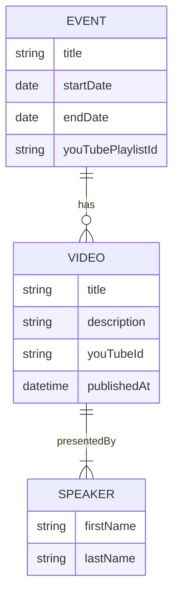

# Glossary

## Entities

<https://mermaid.js.org/syntax/entityRelationshipDiagram.html>

## Other Terms

Some early thoughts on domain language.

* Conference/event - a specific instance of a conference. 
* Conference series/Collection - a collection of conferences. (collection might be a better word since it can connect from multiple conferences)
* Video/Talk/Presentation/Session - the specific recording being presented.
